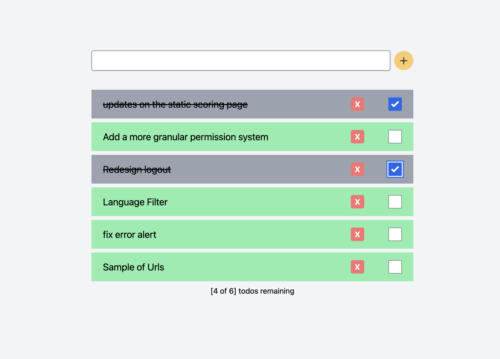

# todo-app

## About The Project


The goal of this repository is to build a Todo application in 1 hour using Tailwind and Typescript.



### Built With

* [React.js](https://reactjs.org/)
* [Typescrit](https://www.typescriptlang.org/)
* [Tailwind](https://tailwindcss.com/)

## Getting Started

### Installation

1. Clone the repo
   ```sh
   git clone https://github.com/your_username_/Project-Name.git
   ```
2. Install NPM packages
   ```sh
   npm install
   ```
3. Start the project on `http://localhost:3000/`
   ```sh
   npm start
   ```